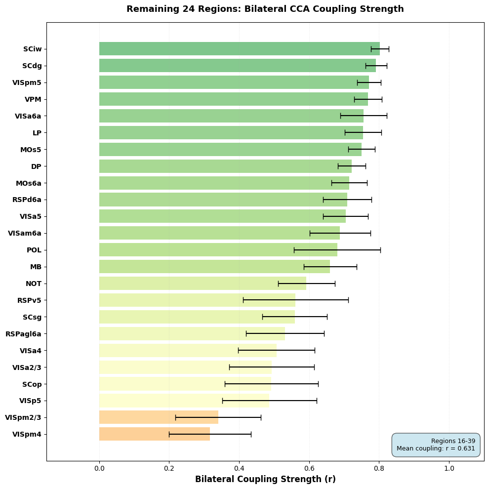
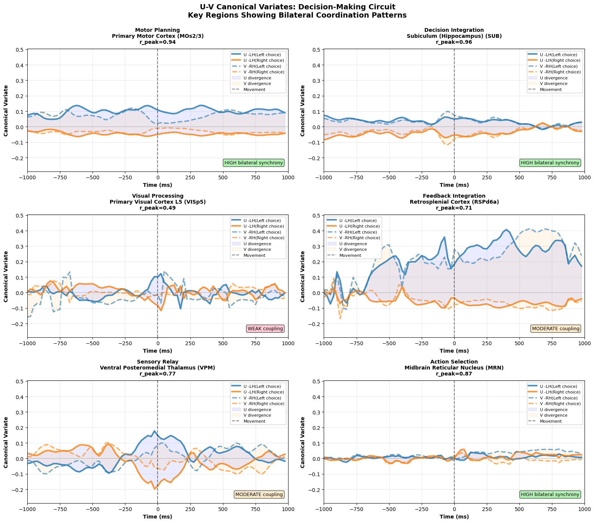
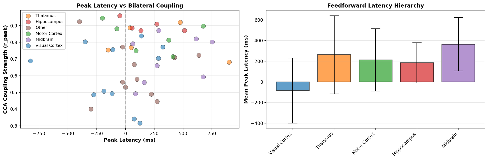
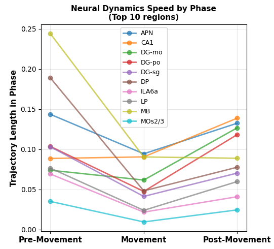
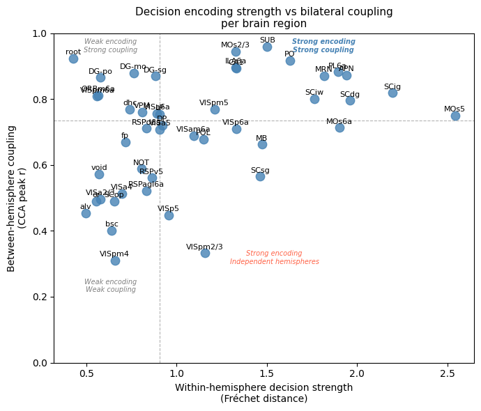
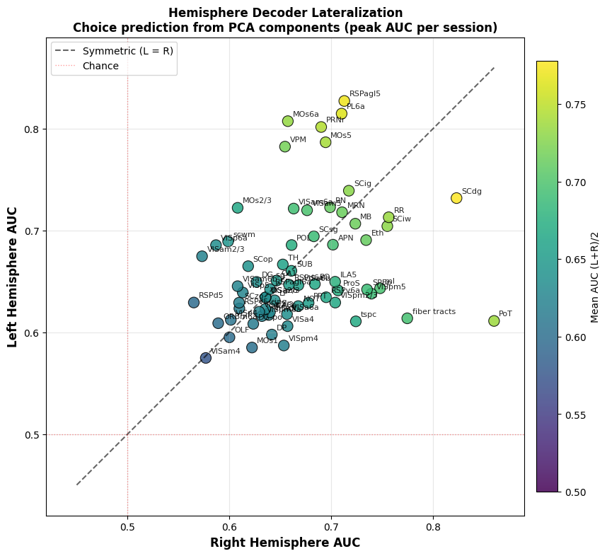
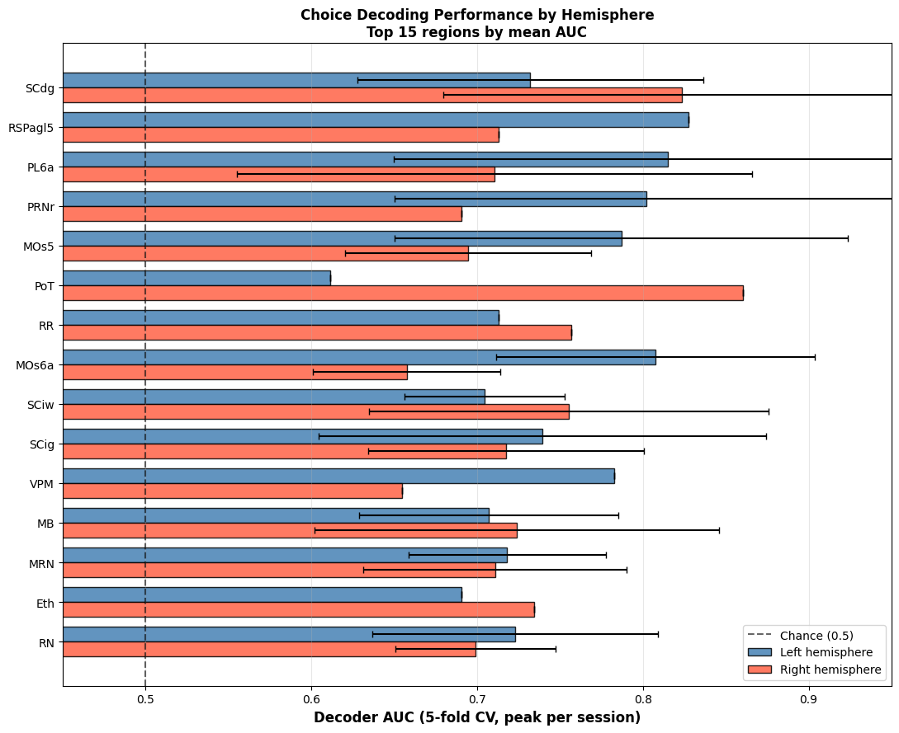

# Supplementary Materials

**Bilateral hemispheric coupling is widespread but does not strictly predict choice encoding across the mouse brain**

Yegarmina, A., Karawita, M., Kaleem, H., Samimi, Z., Nikbakht, N.

---

## Figure 1

Bilateral CCA coupling strength for the remaining 24 brain regions (ranks 16–39). Bars show mean cross-validated peak canonical correlation (r_peak) per region, ranked by coupling strength. Error bars indicate 95% confidence intervals across sessions. Color gradient reflects coupling magnitude (green = stronger, yellow = moderate, orange = weakest). Mean coupling across these 24 regions is r = 0.631, substantially lower than the top 15 (r = 0.878; see main Figure 2). Visual cortex layers (VISpm4, VISpm2/3) show the weakest bilateral coupling in the dataset (r < 0.35), while deep superior colliculus layers (SCdg, SCiw) and thalamic nuclei (VPM, LP) maintain moderate coupling (r ≈ 0.75–0.80).

  

. 

---

## Figure 2

Trial-averaged left (U) and right (V) canonical variate time courses split by choice across representative regions, illustrating bilateral coupling regimes from synchronized motor cortex to weakly coupled visual cortex.

  

.

---

## Figure 3

Peak choice-encoding latency versus bilateral coupling strength across regions, with mean latency by anatomical group revealing a feedforward hierarchy from visual cortex (earliest) through thalamus, motor cortex, and hippocampus to midbrain (latest).

  

.

---

## Figure 4

Phase-separated bilateral coupling metrics across pre-movement, movement, and post-movement trial phases. Trajectory length measures the path length traversed by the canonical variate in each phase (higher values = faster neural dynamics).

  

.

---

## Figure 5

A 2D organizational space integrates within- and between-hemisphere encoding. Plotting within-hemisphere decision strength (Fréchet distance) against between-hemisphere coupling reveals four functional quadrants: strong encoding + strong coupling (PL6a, ILA6a, PO), strong coupling + weak encoding (hippocampal formation), strong encoding + independent hemispheres (MOs5, MOs6a), and weak both.

  

.

---

## Figure 6

Independent population decoders confirm symmetric bilateral choice encoding. Logistic regression decoders trained on the same PCA-reduced subspace as the CCA analysis (3 PCs per hemisphere, 5-fold cross-validation, peak AUC per session).

**6-1:** Scatter of left-hemisphere AUC vs right-hemisphere AUC, one point per region (n = 67 regions sampled bilaterally). The clustering along the diagonal of bilateral symmetry confirms that both hemispheres decode choice with comparable accuracy across the brain.

  

.

**6-2:** Top 15 regions ranked by mean decoder AUC, showing left and right hemisphere performance side-by-side. Top decoders (PL6a, MOs6a, SCdg, MOs5, MRN) overlap substantially with the top CCA choice encoders, validating that the dissociation between bilateral coupling and decision content is method-independent.

  

.
